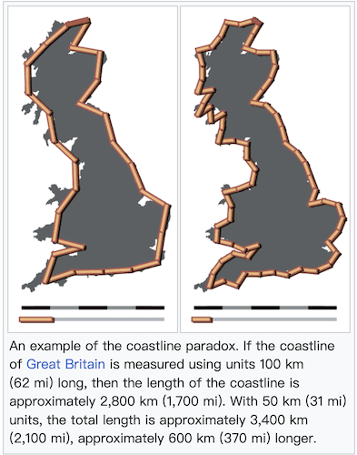

# E9: Generalization

## Warm Up
### The Coastline Paradox
> How long is the coastline of the UK?

You may be want to google but the answer actually is **"It depends on how small your ruler is."**.

In short, the coastline paradox illustrates that the length of a coastline increases as the measurement scale becomes smaller. The more detail you try to capture (bays, inlets, tiny rocks), the longer the line becomes. In theory, with an infinitely small ruler, the length could approach infinity. Mathematically, this phenomenon relates to the concept of fractal dimensions, where natural features exhibit complexity at every scale. You can explore this concept further with [Fractals are typically not self-similar](https://www.youtube.com/watch?v=gB9n2gHsHN4&t=706s), [Coastline paradox, from Wikipedia](https://en.wikipedia.org/wiki/Coastline_paradox), [The Coastline Paradox Explained](https://www.youtube.com/watch?v=kFjq8PX6F7I&pp=ygURY29hc3RsaW5lIHBhcmFkb3g%3D).  

> The Earth’s features are complex, but maps are finite. Generalization helps us balance truth and usability.

### How Do We Measure Information?
We often feel that more detail = more information. But is that really true? In cartography and map design, the concept of **user load** refers to the cognitive effort required to interpret and understand a map. It includes perceived complexity, visual density, and the mental processing burden on the user. 

On the other hand, there are also several **objective methods** for quantifying the amount of information a map contains, often borrowed from *information theory* and spatial data analysis. These include:

- **Shannon Entropy**
- **Symbol Density** 
- **Compression Ratio** 

> A good map strikes a balance—delivering the right amount of information without overwhelming the user.

## Task
In this exercise, you will practice several **fundamental cartographic generalization techniques** in ArcGIS Pro.  
The goal is to simplify and adapt map features for small-scale representation (1:25,000), while maintaining legibility and spatial logic.

### Overview  
- [ ] **Simplify Water Polygons**  
  - Reduce unnecessary nodes and smooth geometry of lakes and rivers.  
- [ ] **Aggregate and Simplify Woodland Areas**  
  - Merge fragmented forest patches and generalize outlines while avoiding residential overlaps.  
- [ ] **Exaggerate Watercourse Lines**  
  - Simplify and smooth creek geometries to emphasize characteristic curves.  
- [ ] **Typify Double-Line Underground Features**  
  - Collapse double rail lines into single features.  
- [ ] **Aggregate and Simplify Buildings**  
  - Combine small structures and preserve orthogonal forms.  
- [ ] **Classify Land Use Layers**  
  - Merge land use types (e.g. grass, park, scrub) into generalized categories.  
- [ ] **Select and Filter Road/Path Features**  
  - Retain only relevant road/path types for the final map scale.  
- [ ] **Displace Point Symbols**  
  - Adjust symbol placement for better readability in dense areas.  
- [ ] **Adjust Visual Layer Order**  
  - Organize and style layers to produce a clean and readable 1:25,000 map. 
### Descriptions
Detailed instructions in {download}`Lesson 9 <../doc/Lesson 9.docx>`

& You can [Click here to look](./lessons/lesson9.md)

#### Data
- `E8_data.gbd`  
- `Template.aprx`

#### 1. Simplify Water Polygons 
- Select `osm_water` polygons & Use *Simplify Polygon* with Douglas-Peucker algorithm.  
- Then use *Smooth Polygon* with Bezier interpolation to refine shapes.

#### 2. Aggregate and Simplify Forests  
- Extract `forest` and `residential` land use from `osm_landuse`.  
- Use *Aggregate Polygons* to merge forest patches.  
- Use *Simplify Polygon* with Zhou-Jones algorithm, preserving boundaries with `residential` as a barrier.  
- Apply *Smooth Polygon* to improve visual quality.

#### 3. Exaggerate Watercourse Lines  
- Use *Simplify Line* on `osm_waterways` with Douglas-Peucker.  
- Prevent overlaps by adding `residential` as a barrier.  
- Apply *Smooth Line* with Bezier interpolation to emphasize meandering.

#### 4. Typify Underground Lines  
- Use *Merge Divided Roads* on `osm_railways` to collapse parallel tracks into a single line.  
- Filter by `code` field to merge only matching classes.

#### 5. Aggregate Buildings  
- Use *Aggregate Polygons* on `osm_buildings`.  
- Enable *Preserve Orthogonal Shape* and add `osm_roads` as a barrier layer.  
- Style generalized layer with dark grey fill, no outline.

#### 6. Classify Land Use  
- Combine green spaces (`park`, `grass`, `scrub`, `recreation_ground`) into a unified `park` layer.  
- Merge `industrial` and `commercial` into one general use layer.  
- Symbolize each layer with appropriate simple fills.

#### 7. Select and Symbolize Paths  
- In `osm_paths`, display only `track_grade5` class using *Symbology > Unique Values*.  
- Filter out other values and apply a simple gray line style.

#### 8. Displace Point Symbols  
- Manually move overlapping point symbols for better layout readability.  
- Use `Modify Features > Move` to reposition features without loss of meaning.

#### 9. Adjust Layer Order and Export 
- Style and order necessary layers properly.  
- Export the 1:25,000 map layout to *PDF*.

### Optional Task
You can check [cartography-playground](https://cartography-playground.gitlab.io/playgrounds/cartographic-generalization/) for easier hands-on about catrographical generalization.

## Materials
- [An overview of the Generalization toolset](https://pro.arcgis.com/en/pro-app/latest/tool-reference/cartography/an-overview-of-the-generalization-toolset.htm)
- [A solution to the problem of the generalization of the Italian geographical databases from large to medium scale: approach definition, process design and operators implementation](https://kartographie.geo.tu-dresden.de/downloads/ica-gen/publications/savino.pdf)
- [Understanding conflict resolution and generalization](https://pro.arcgis.com/en/pro-app/latest/tool-reference/cartography/understanding-conflict-resolution-and-generalization.htm)
- [Cartographic generalization, from Wikipedia](https://en.wikipedia.org/wiki/Cartographic_generalization)
- [Generalization in maps](https://docs.maptiler.com/guides/maps-apis/maps-platform/generalization-in-maps/)